# **Analyseur de Données**

## 📑 Table des Matières

1. [📘 Description du Projet](#-description-du-projet)
2. [⚙️ Installation et Configuration](#️-installation-et-configuration)
3. [🧩 Utilisation](#-utilisation)
4. [🛠️ Technologies Utilisées](#️-technologies-utilisées)
5. [📊 Exemples de Code](#-exemples-de-code)
6. [👥 Contributeurs](#-contributeurs)
7. [🤝 Contribution](#-contribution)
8. [📸 Captures d'écran](#-captures-d'écran)

---

## 📘 Description du Projet

**Analyseur de Données** est une application web construite avec Django pour analyser des fichiers de données (CSV et Excel). Elle permet aux utilisateurs de :

- Télécharger des fichiers.
- Calculer des statistiques descriptives comme la moyenne, la médiane, le mode, la variance, et l’écart-type.
- Analyser les corrélations entre les colonnes.
- Télécharger les résultats sous forme de fichiers CSV ou PDF.
- Générer des visualisations comme des histogrammes, heatmaps, régressions, etc.

### Objectif Principal

Créer un outil convivial et fonctionnel pour analyser des données et produire des visualisations afin d’en extraire des insights.

---

## ⚙️ Installation et Configuration

### Prérequis

- Python 3.8+
- `pip` (gestionnaire de paquets Python)
- Django 5.0+
- Bibliothèques supplémentaires : `pandas`, `matplotlib`, `seaborn`, `openpyxl`, `reportlab`
- Base de donnée SQLite ou PostgreSQL
- Git installé sur le système

### Étapes d’installation

1. **Clonez le dépôt :**

    ```bash
    git clone https://github.com/yourusername/analyseur_donnees.git
    cd analyseur_donnees
    ```

2. **Installez les dépendances :**

    ```bash
    pip install -r requirements.txt
    ```

3. **Configurez les paramètres du projet :**

    - Créez un fichier `.env` dans le répertoire racine du projet et ajoutez les paramètres nécessaires.
    - Alternativement, vous pouvez configurer directement dans `settings.py` :
      - `SECRET_KEY`, `DEBUG`, `STATIC_ROOT`, `MEDIA_ROOT`
    - Assurez-vous que les paramètres de la base de données sont correctement configurés.

    Exemple dans `settings.py` :

    ```python
    STATIC_ROOT = os.path.join(BASE_DIR, 'staticfiles')
    MEDIA_ROOT = os.path.join(BASE_DIR, 'uploads')
    ```

    Exemple dans `settings.py` pour PostgreSQL :

    ```python
    DATABASES = {
        'default': {
            'ENGINE': 'django.db.backends.postgresql',
            'NAME': 'votre_nom_de_bd',
            'USER': 'votre_utilisateur',
            'PASSWORD': 'votre_mot_de_passe',
            'HOST': 'localhost',
            'PORT': '5432',
        }
    }
    ```

    Exemple dans `settings.py` pour SQLite :

    ```python
    DATABASES = {
        'default': {
            'ENGINE': 'django.db.backends.sqlite3',
            'NAME': os.path.join(BASE_DIR, 'db.sqlite3'),
        }
    }
    ```

4. **Exécutez les migrations :**

    ```bash
    python manage.py migrate
    ```

5. **Collectez les fichiers statiques :**

    ```bash
    python manage.py collectstatic
    ```

6. **Créez un superutilisateur :**

    ```bash
    python manage.py createsuperuser
    ```

7. **Lancez le serveur local :**

    ```bash
    python manage.py runserver
    ```

    Accédez à l'application à l'adresse [http://127.0.0.1:8000](http://127.0.0.1:8000).

---

## 🧩 Utilisation

### Fonctionnalités Principales

- **Page d’accueil :** Navigation vers le profil utilisateur, l’historique des analyses, ou la page de téléchargement.
- **Téléchargement de fichiers :** Supporte les fichiers CSV et Excel.
- **Analyse statistique :**
  - Moyenne, médiane, mode, variance, écart-type.
- **Visualisations :** Génération d’histogrammes, heatmaps, scatter plots, boxplots, bar charts.
- **Historique des analyses :** Tableau des fichiers analysés avec téléchargement des résultats (CSV ou PDF).
- **Authentification sécurisée :** Inscription, connexion, gestion de profil.

---

## 🛠️ Technologies Utilisées

- **Backend :** Django (Python)
- **Frontend :** HTML, CSS (Bootstrap 5)
- **Manipulation de données :** Pandas, NumPy
- **Visualisations :** Matplotlib, Seaborn
- **Base de données :** SQLite ou PostgreSQL
- **Rapports PDF :** ReportLab
- **Fichiers Excel :** Openpyxl

---

## 📊 Exemples de Code

### Vue pour le Téléchargement de Fichier

```python
@login_required
def upload_file(request):
    if request.method == 'POST':
        form = UploadFileForm(request.POST, request.FILES)
        if form.is_valid():
            file = form.cleaned_data['file']
            # Lecture et traitement du fichier
            df = pd.read_excel(file, engine='openpyxl') if file.name.endswith('.xlsx') else pd.read_csv(file)
            # Calcul des statistiques et sauvegarde des résultats
            ...
            messages.success(request, f"Analyse de {file.name} terminée.")
            return redirect('analysis_history')
    else:
        form = UploadFileForm()
    return render(request, 'upload.html', {'form': form})
```

## 📊 Template pour l’Historique des Analyses

```html
<table class="table table-bordered table-hover align-middle text-center">
    <thead>
        <tr>
            <th>Nom du Fichier</th>
            <th>Date</th>
            <th>Moyenne</th>
            <th>Médiane</th>
            <th>Actions</th>
        </tr>
    </thead>
    <tbody>
        
        <tr>
            <td>{{ analysis.file_name }}</td>
            <td>{{ analysis.upload_date }}</td>
            <td>{{ analysis.mean }}</td>
            <td>{{ analysis.median }}</td>
            <td>
                <a href="" class="btn btn-primary">Visualiser</a>
                <a href="" class="btn btn-danger">Supprimer</a>
            </td>
        </tr>
        
    </tbody>
</table>
```

---

## 👥 Contributeurs

- **Mohamed Lakssir**
- **Houssam Aoun**

---

## 🤝 Contribution

1. **Forkez le projet :**

    ```bash
    git clone https://github.com/yourusername/analyseur_donnees.git
    cd analyseur_donnees
    ```

2. **Travaillez sur une branche dédiée :**

    ```bash
    git fetch origin feature-houssam
    git checkout feature-houssam
    ```

3. **Proposez vos modifications :**

    ```bash
    git add .
    git commit -m "Ajout de [votre fonctionnalité ou correction]"
    git push origin feature-houssam
    ```

4. **Ouvrez une Pull Request pour révision.**

## 📸 Captures d'écran

#### Page de Connexion

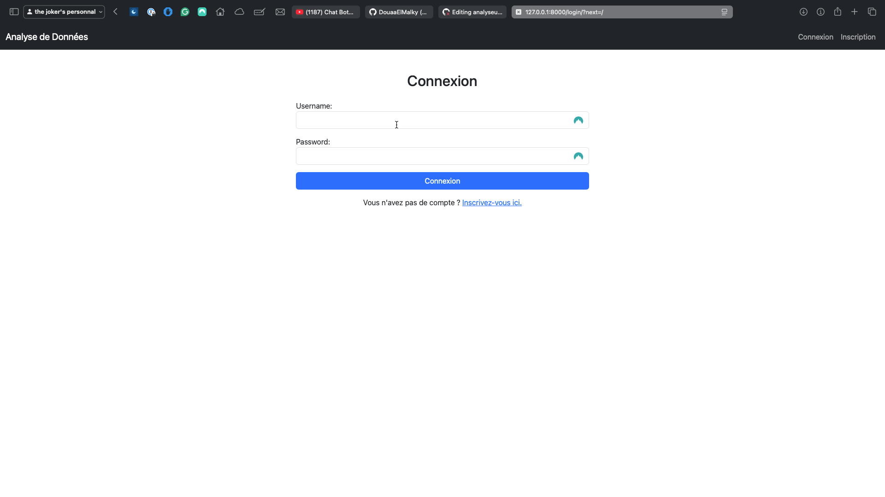

#### Page d'Accueil

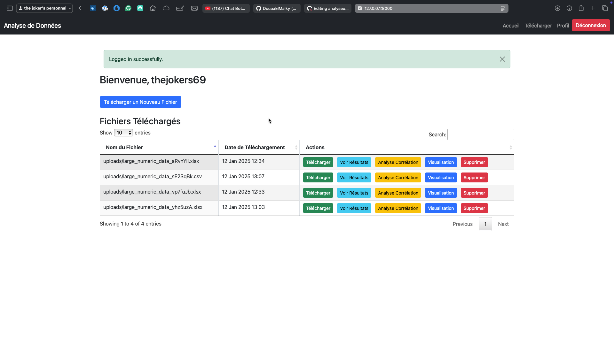

#### Options de Visualisation

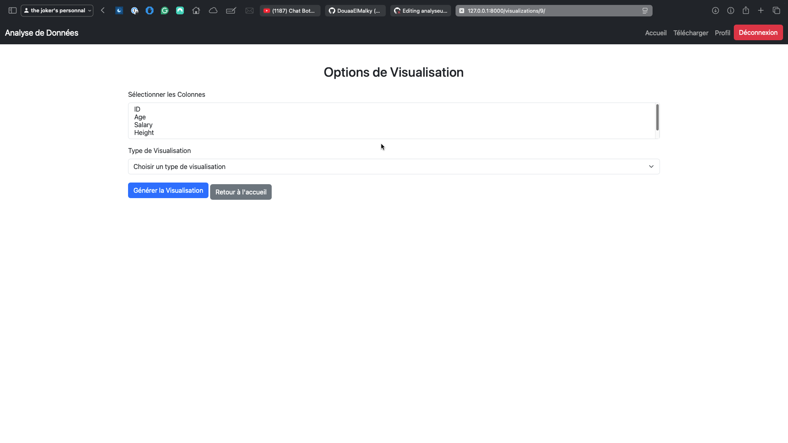

#### Page de Profil

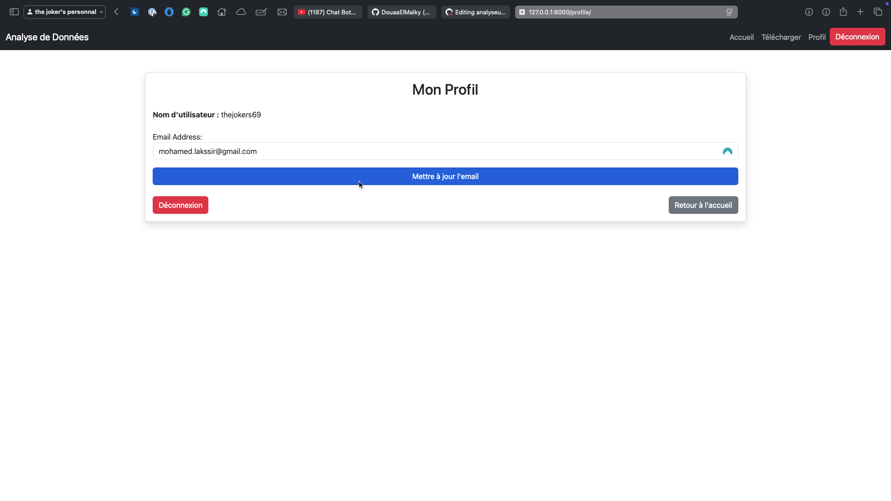

#### Page d'Inscription

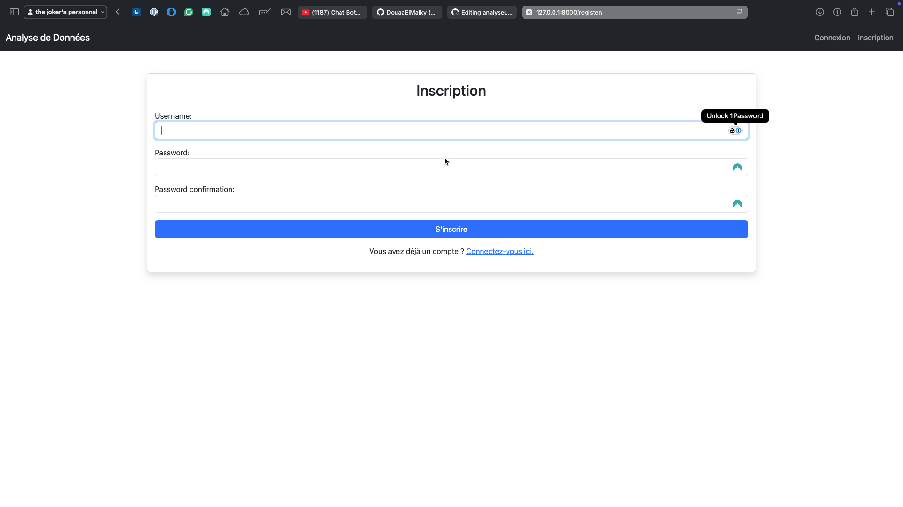

#### Résultats d'Analyse - Partie 1

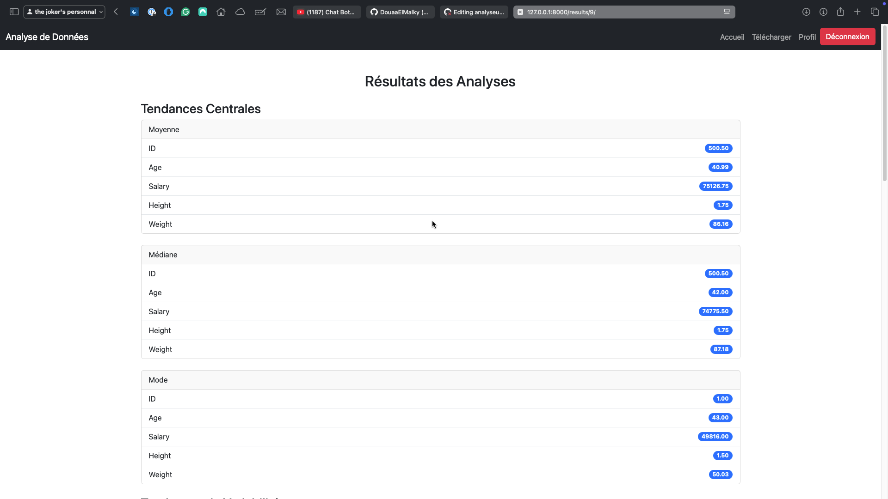
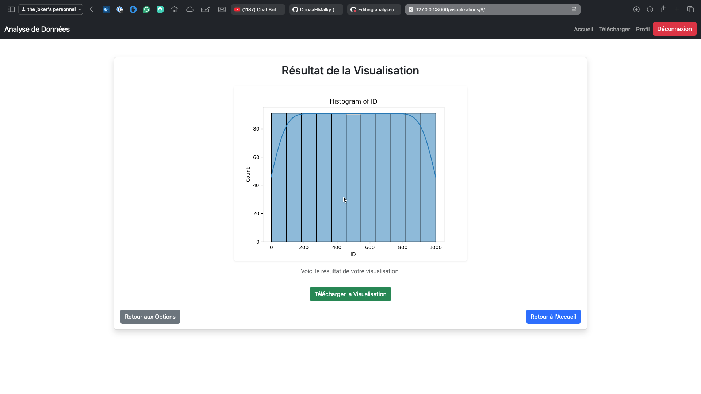

#### Résultats d'Analyse - Partie 2


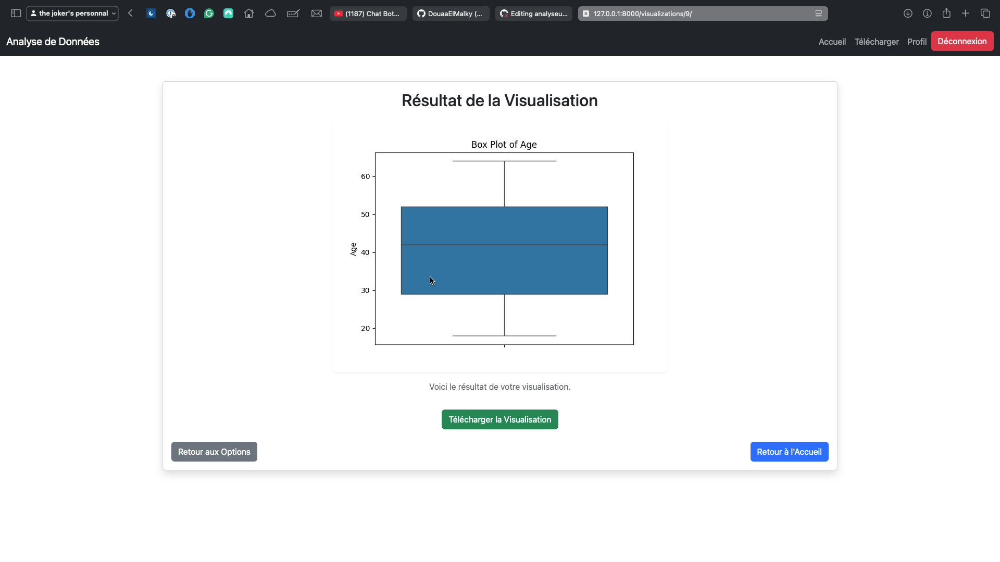

#### Résultats d'Analyse - Partie 3

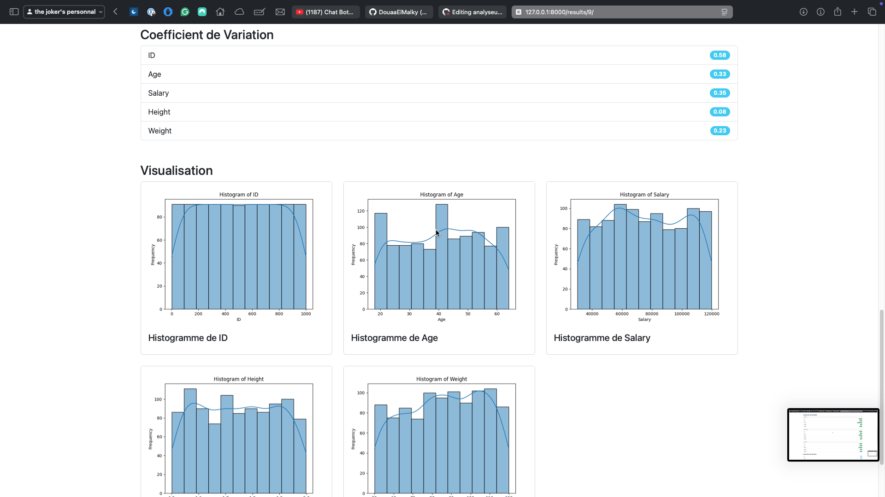
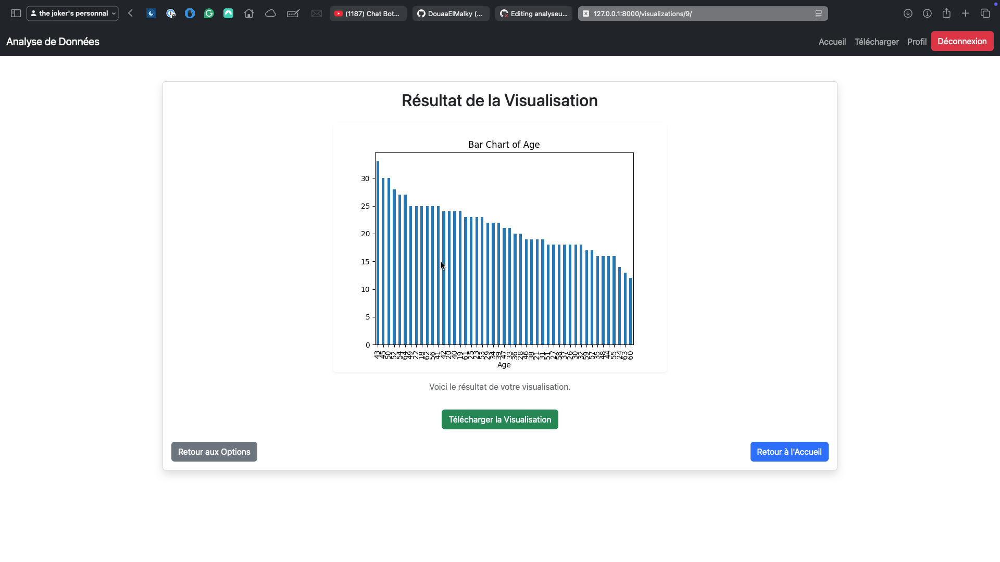

#### Téléchargement Réussi

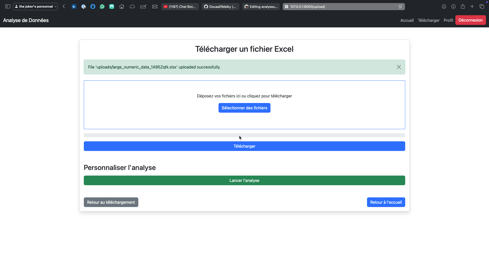

#### Page de Téléchargement

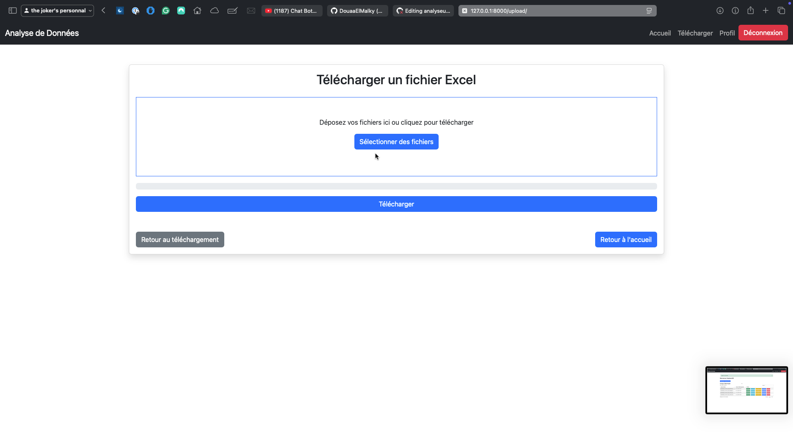

---

## 🔐 Database SSL / Secure MySQL connection

If your MySQL server requires TLS/SSL, this project supports configuring the connection via environment variables. Copy `.env.example` to `.env` and fill the values.

Important environment variables (see `.env.example`):

- `MYSQL_DB_NAME`, `MYSQL_DB_USER`, `MYSQL_DB_PASSWORD`, `MYSQL_DB_HOST`, `MYSQL_DB_PORT`
- `MYSQL_SSL_MODE` (e.g. `VERIFY_IDENTITY`, `VERIFY_CA`, `REQUIRED`, `DISABLED`)
- `MYSQL_SSL_CA` — path to CA bundle file
- `MYSQL_SSL_CERT` — path to client certificate (if required)
- `MYSQL_SSL_KEY` — path to client key (if required)

Place certificate files outside the repository (don't commit them). Use absolute paths in the `.env` file or paths relative to the project root.

Example `.env` entries:

```bash
MYSQL_SSL_MODE=VERIFY_CA
MYSQL_SSL_CA=/etc/ssl/certs/ca.pem
MYSQL_SSL_CERT=/etc/ssl/certs/client-cert.pem
MYSQL_SSL_KEY=/etc/ssl/private/client-key.pem
```

When these variables are set and `MYSQL_SSL_MODE` is not `DISABLED`, Django will pass SSL options to the MySQL client connector. Ensure your connector (`mysqlclient` or `PyMySQL`) supports the provided options.
